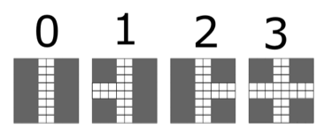

# Artificial Intelligence

Create a program which uses a Neural Network to identify simple 8x8 black and white images (see images below) that fit into eight categories. The resulting program could be extended to assist the [AVC](https://github.com/BryonyGatehouse/University-Engineering-Technology/blob/master/AVC%20Project) vehicle to follow a line.

